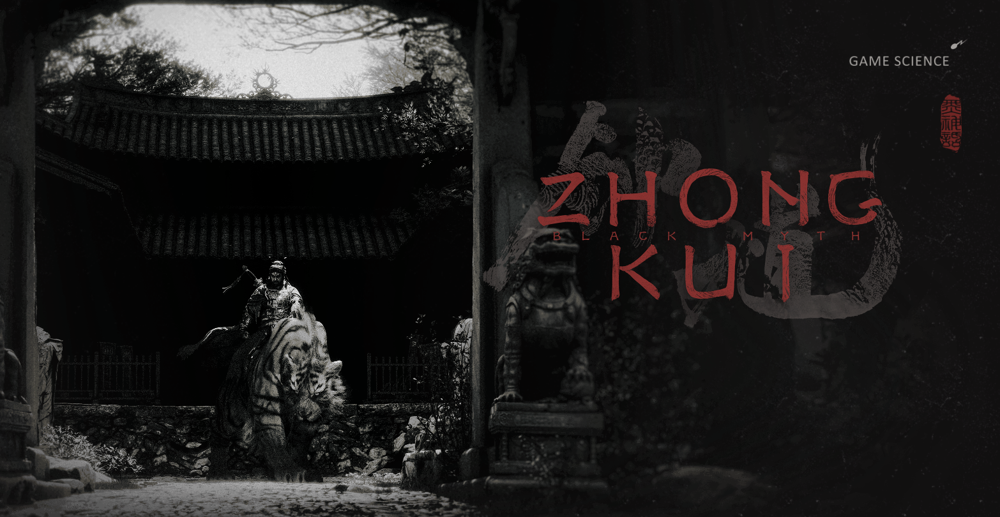

# 黑神话 - 钟馗  

中国黑神话系列3A游戏

  随着黑神话-悟空（中国第一部真正意义的3A大作）大获成功，黑神话系列的下一部《黑神话-钟馗》也逐渐浮出水面。
  作为喜爱黑神话的粉丝，对钟馗要作一番研究啊。

## 钟馗人物来源  

### 维基的说法  

     维基网站说是这样说的：
     钟馗是中国民间传说的神祗，后被纳入道教信仰的体系，专能驱魔，辟邪和镇宅，尊称为驱魔真君，中南进士。

     关于其源流有多种说法：

    -  法器说：钟馗是由逐鬼法器“终葵”的谐音。 

        “终葵”为逐鬼之物，被取为人名作辟邪之用。《左传•定公四年》记殷商遗民气族中，有“终葵氏”，终葵即“锥”的反切音，终葵氏的意思就是--以锥驱鬼之氏族也。后来逐渐以“终葵”为辟邪之意，逐渐演变为“终葵”、“钟馗”。

    -  唐玄宗梦仙说：

        “钟馗”一名最早见于《唐逸史》。话说唐明皇（玄宗）病中梦见小鬼偷去玉笛和杨贵妃（杨玉环）的绣番囊，正当大怒之时，见一满面虬髯大鬼，挖下小鬼的眼珠吞掉。此鬼自称南山钟馗，高祖年间应考武举人，但是因其貌不扬，不被主考官喜爱，而落第，羞愤撞殿前石阶而死。蒙高祖赐缘袍陪葬，钟馗物化后发誓要为大唐斩妖除魔。唐明皇醒后，其病不药而愈，遂向吴道子忆述梦中所见，并命其绘出钟馗像，颁布天下。民间也挂其画像驱鬼辟邪。

### 百度百科的说法  

    《钟馗传略》这样记载：“夫钟馗者，姓钟名馗，古有雍州终南人也，生于终南而居于终南，文武全修，豹头环眼，铁面虬鬓，相貌奇异，经纶满腹，刚正不阿，不惧邪祟，待人正直、肝胆相照、获贡士首状元不及，抗辩无果，报国无门，舍生取义，怒撞殿柱亡，皇以状元职葬之，托梦驱鬼愈唐明皇之疾，封‘赐福镇宅圣君’，诏告天下，遍悬《钟馗赐福镇宅图》护福祛邪魅以佑平安。故名噪天下也！” 。

    《历代神仙通鉴》的记载与之十分相似：钟馗系陕西终南人，少时即才华出众。唐武德年间，赴京城应试，却因相貌丑陋而落选，愤而撞死殿阶。帝闻之，赐以红官袍安葬。到了天宝年间，相传唐玄宗李隆基在临潼骊山偶患脾病，久治不愈，一晚梦见一相貌奇伟之大汉，捉住一小鬼，剜出其眼珠后，将其吃掉。大汉声称自己为“殿试不中进士，钟馗”，皇帝梦醒，即刻病愈。于是，唐玄宗命吴道子将梦中钟馗捉鬼情景作成一幅画，悬于宫中以避邪镇妖。

## 钟馗人物形象  

- 游戏数科官网的钟馗骑虎图

- 网上找到的为数不多的据说是吴道子的钟馗戏鬼，该画古石壁现存于陕西省西安市户县大重阳万寿宫内

- 这副不知道出处

- 这副从维基网站上找的，日本的钟馗抓鬼图
  

