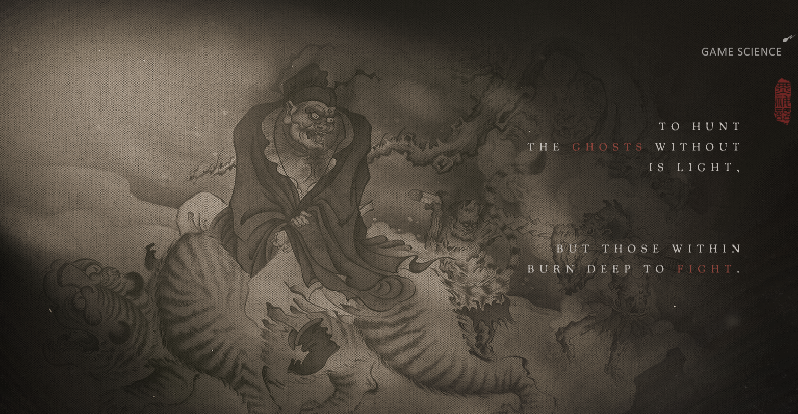
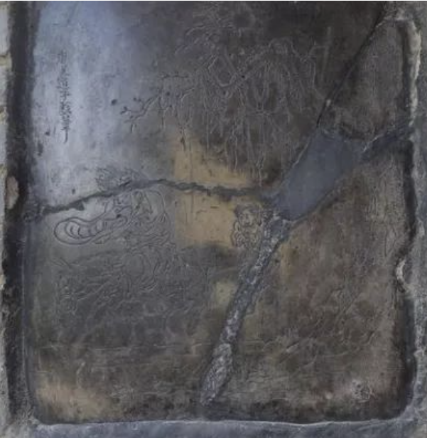
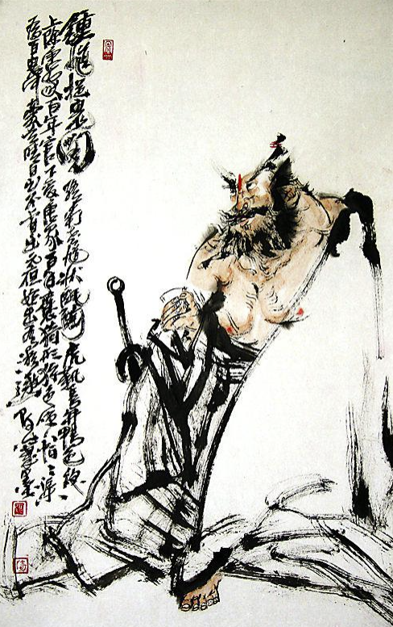
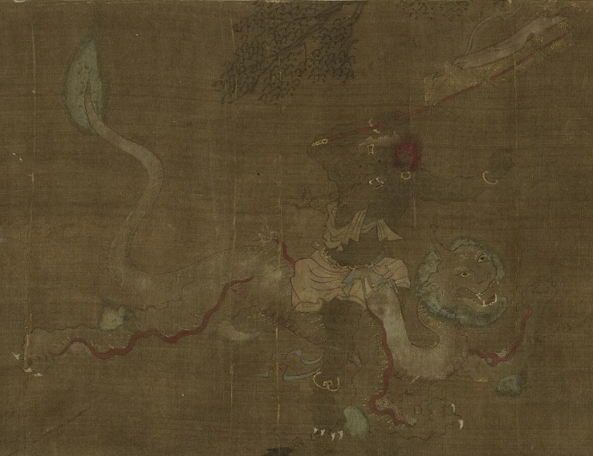

# 钟馗人物来源  

## 维基百科的说法  

钟馗是中国民间传说的神祇，后被纳入道教信仰体系，专司驱魔、辟邪和镇宅，尊称为“驱魔真君”，亦称“中南进士”。  

关于其源流有多种说法：

**1. 法器说**  

- 钟馗可能源于逐鬼法器“终葵”的谐音  

- “终葵”为逐鬼之物，后取为人名作辟邪之用。《左传·定公四年》记载殷商遗民七族中，有“终葵氏”。“终葵”即“锥”的反切音，终葵氏意为以锥驱鬼的氏族。后来逐渐以“终葵”为辟邪之意，并演变为“终葵”、“钟馗”。

**2. 唐玄宗梦仙说**  

- “钟馗”一名最早见于《唐逸史》。传说唐玄宗病中梦见小鬼偷去玉笛和杨贵妃的绣囊，正当大怒时，见一满面虬髯大鬼挖掉小鬼眼珠并吞下。此鬼自称南山钟馗，因貌丑武举落第，羞愤撞阶而死，受高祖赐袍陪葬，死后立誓为大唐斩妖除魔。  
- 玄宗醒后病愈，命吴道子绘出钟馗像，颁布天下。民间亦挂其画像以驱鬼辟邪。

## 百度百科的说法  

《钟馗传略》记载：  
> “夫钟馗者，姓钟名馗，古有雍州终南人也，生于终南而居于终南，文武全修，豹头环眼，铁面虬鬓，相貌奇异，经纶满腹，刚正不阿，不惧邪祟，待人正直、肝胆相照、获贡士首状元不及，抗辩无果，报国无门，舍生取义，怒撞殿柱亡，皇以状元职葬之，托梦驱鬼愈唐明皇之疾，封‘赐福镇宅圣君’，诏告天下，遍悬《钟馗赐福镇宅图》护福祛邪魅以佑平安。故名噪天下也！”

《历代神仙通鉴》记载与之相似：  
> 钟馗系陕西终南人，才华出众。唐武德年间赴京应试，因相貌丑陋落选，愤而撞死殿阶。皇帝赐红官袍安葬。至天宝年间，唐玄宗患病梦一大汉捉小鬼食之，自称“殿试不中进士钟馗”。玄宗醒后病愈，遂命吴道子作画悬于宫中避邪。

---

# 钟馗人物形象  

## 1. 游戏官网 - 钟馗骑虎图  

## 2. 传吴道子《钟馗戏鬼图》  

- 网上为数不多的传为吴道子所作，原《钟馗抓鬼图》已失传。  
- 该画古石壁现存于陕西省西安市户县大重阳万寿宫内。  
  

## 3. 未知出处钟馗画作  

## 4. 日本《钟馗抓鬼图》  

- 来自维基百科，展现钟馗在东亚文化中的影响。  

## 5.钟馗嫁妹图中的坐骑图  

- 个人觉的黑神话钟馗游戏里，如果坐骑用这个会更好，名字也好听。

---

**说明**：  

- 以上内容整理自公开资料，仅供参考  
  